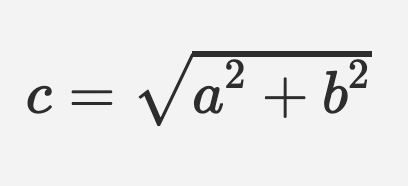

# Ruby Practice

Run your Ruby file by typing `ruby ` and then the name of the file you want to run in the Terminal.

If we want to run `float_round.rb`, we can write the command:

```bash
ruby float_round.rb
```

To re-run this command, you can use the UP and DOWN arrow keys to look at the history of commands you've run in a Terminal.

## Float
### float_find_hypotenuse.rb
A right triangle's two shorter sides have length 2.8 and 4.5. How long is its longest side?

Remember: the Pythagorean Theorem says that




where a and b are the lengths of the shorter sides, and c is the length of the longest side.

Your output should be a number; for example,

5.3


Read more about the formula: https://www.mathsisfun.com/pythagoras.html
### float_rounding.rb
Output ten divided by 3 rounded to 3 decimal places.

## Specs
<details>
  <summary>Click here to see names of each test</summary>

float_find_hypotenuse.rb should output '5.3'' 

float_round.rb should output '3.333' 

</details>